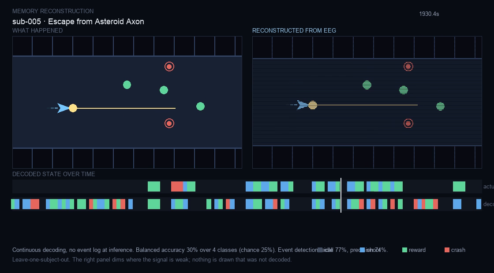
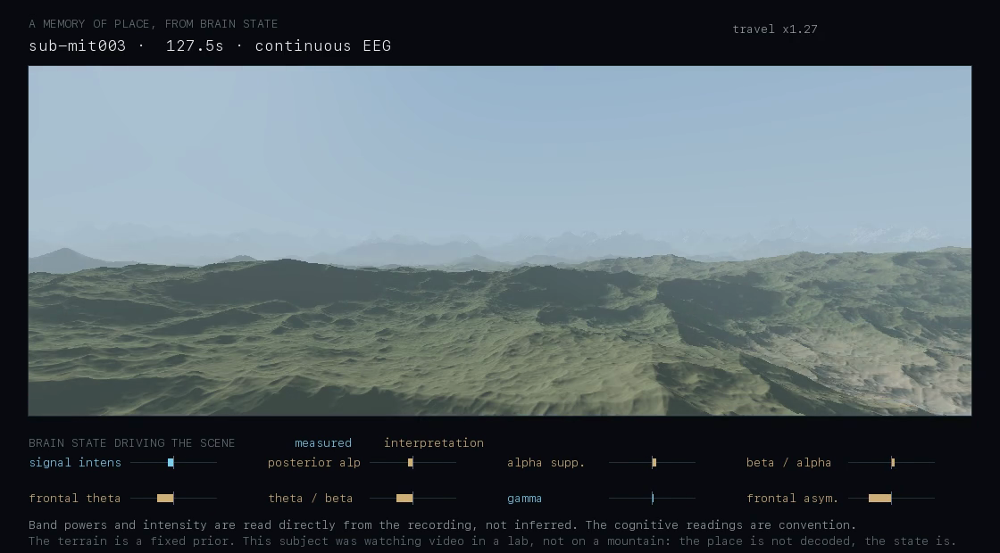
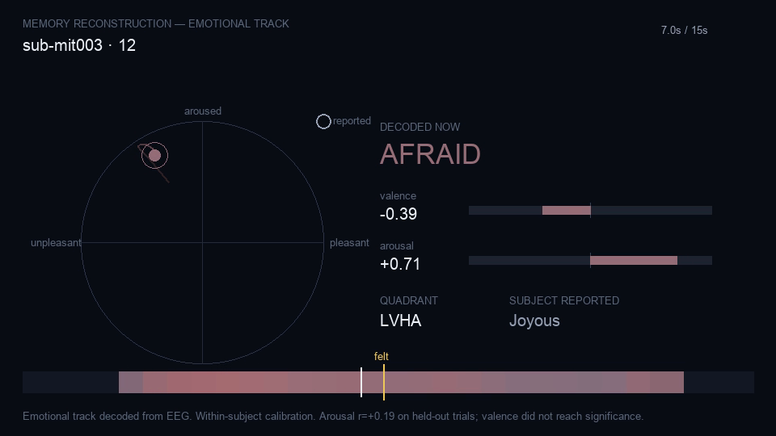

# MindScape

**A neural memory reconstruction platform.** MindScape transforms scalp EEG brainwave signals into explorable digital environments, recovering watched experiences and scoring the result against the original reference stimulus.

> **"Entering Someone Else's Reality"** — What if memories, dreams, and emotions could become places you could physically enter and explore? Read our full vision & architecture: [`docs/VISION_AND_INSPIRATION.md`](docs/VISION_AND_INSPIRATION.md).

---


## The memory video

A continuous side-by-side reconstruction: the world as it was, and the world
as the EEG alone recovered it, played back at 25 fps.



No event log at inference — a window slides across the whole recording and the
brain activity decides, every 250 ms, what is happening.

| Continuous, leave-one-subject-out | Result | Chance |
| --- | --- | --- |
| **Event detection — recall** | **76.6%** | — |
| **Event detection — precision** | **72.6%** | — |
| Which event it was (3-class) | 30.2% | 33% |

**Detection works, classification does not.** The *rhythm* of the session is
genuinely recovered — when things happened, the bursts and the lulls. Which
particular thing happened at each moment mostly is not, and the right panel
dims to show it. Nothing is drawn that was not decoded.

---

## The same engine, on real-world imagery

Not a game: **photographs of real things**, retrieved from brain activity
alone while someone viewed them. Left is what was on screen; the other two
panels are what the EEG recovered from a single glimpse and from eight.


| Eight held-out viewings, 200 candidates | Result | Chance |
| --- | --- | --- |
| **Same object in the top 5** | **42.4%** | ~10% |
| Exact photograph in the top 5 | 20.1% | 2.5% |
| Exact photograph recovered | 7.6% | 0.5% |
| Graded semantic similarity | 0.254 | 0.137 |

**What comes back is the kind of thing seen, not which one.** When a hat was
on screen the ranked strip often contains a hat — a different hat,
photographed differently. Shuffled labels land on chance everywhere, and a
strict time split does not collapse the result. Full write-up and controls:
[`backend/REALLIFE.md`](backend/REALLIFE.md).

---

## An environment reconstructed from EEG

Object identification is 7.6% exact — far too weak to build a world from. But
identification is the wrong question. Regressed onto the **visual statistics**
of what was on screen, EEG does much better:

| Property | r | shuffled |
| --- | --- | --- |
| edge density | **0.69** | 0.07 |
| mean red | 0.64 | −0.02 |
| saturation | 0.64 | 0.05 |
| luminance | 0.62 | −0.01 |
| contrast | 0.58 | 0.01 |


Two landscapes: left graded from the photograph's true statistics, right from
brain activity alone. Same terrain, same camera, same sun — **only appearance
is decoded**, and a property must clear r = 0.35 held-out before it may move
anything. Mean per-moment agreement **r = 0.38**.

Scalp EEG carries *how a scene looked* far better than *what was in it*, which
is why a landscape works where object reconstruction does not. Details:
[`backend/ENVIRONMENT.md`](backend/ENVIRONMENT.md).

---

## A memory of place, from brain state

A continuous recording of someone having an experience, rendered as terrain
you travel through. Light, air, colour, ground and the *speed of travel* all
follow the recording moment to moment.



The distinction that carries this: **band power is not a guess.** Every
reconstruction above has an inference gap with an error bar on it — object
identity 7.6%, visual properties r = 0.47–0.69, cross-subject emotion a
documented failure. Alpha power over occipital cortex simply *is* alpha power
over occipital cortex. Binding a landscape to it is a faithful rendering of
the signal, not a claim about the world, which is why there is no accuracy
figure here: nothing is being predicted.

Channels marked *interpretation* on the frame are where a cognitive meaning is
assumed on top of a measurement. Frontal asymmetry moves the least of
anything, deliberately — it is the one reading this project already tested and
found wanting.

**Nobody in this dataset was on a mountain.** The terrain is a fixed prior; the
place is not decoded, the state is. Details and what a real recording would
need: [`backend/MEMORY_OF_PLACE.md`](backend/MEMORY_OF_PLACE.md).

---

## What the body was doing

Not what someone saw — what they **did**. Left is the action performed, right
is the action recovered from motor cortex alone, in real time.


| 20 subjects, leave-one-run-out, balanced | Result | Chance |
| --- | --- | --- |
| **Moving vs still** | **76.3%** | 50% |
| **Fists vs feet** | **75.5%** | 50% |
| Left vs right fist | 62.0% | 50% |
| Exact action, five ways | 36.7% | 20% |

**The gradient is the finding.** How well a distinction decodes tracks how far
apart the body parts sit on the cortex: hands versus feet is easy, which hand
is barely better than a coin. Shuffled labels score 19.6%. Read the spread —
per-subject exact accuracy ranges 24-60%, and some people sit near chance
throughout.

**Position beats channel count.** Four electrodes over motor cortex decode
better (28.7%) than eight frontal ones (24.4%); a Muse layout scores 22.3%
against 20% chance, because it has no sensor near the sensorimotor strip.
Full write-up, including the three approaches that were tried and rejected:
[`backend/MOTOR.md`](backend/MOTOR.md).

---

## Reconstructing an activity from EEG

Someone **playing a video game** — actively doing something, not passively
watching — with the activity recovered from brain activity alone and rendered
as video.


| Leave-one-subject-out | Accuracy | Chance | Shuffled |
| --- | --- | --- | --- |
| Reward vs crash | **60.7%** | 50% | 50.9% |
| Fired vs reward | **64.3%** | 50% | — |
| Three-way | **49.1%** | 33% | 33.7% |

Every one of six subjects is above chance, and shuffled controls collapse to
chance. This works where emotion decoding failed because reward and error
feedback are among the largest effects in EEG — measured here at ~1 µV
frontocentral separation 200-350 ms after an outcome.

Honest limitation: event *timing* comes from the game log. What EEG decodes is
*which* event each known moment was. Full detail: [`backend/GAMEPLAY.md`](backend/GAMEPLAY.md).

---

## Video reconstruction with per-frame emotion

`tools/render_memory.py` writes a real `.mp4` — 960×540, 25 fps — reconstructing
a viewing moment by moment: decoded valence and arousal at every instant, the
trajectory on the affective circumplex, the nearest named emotion, and a marker
where the subject clicked to say they felt something.



**The video renders correctly. The decoding underneath it largely does not.**
Cross-subject emotion decoding failed outright — the shuffled control scored
*higher* than the real model (38.9% vs 34.7% on quadrant). Within-subject,
arousal is weakly readable (r = +0.19, 58.8% balanced) and valence is not
readable at all (42.8% balanced, below chance).

That negative result, the two measurement errors found while getting to it, and
what would be needed to fix it: [`backend/EMOTION.md`](backend/EMOTION.md).

---

## Real human EEG

The headline capability runs on **recordings of actual people** viewing 200
objects — not simulation. From held-out brain activity the system ranks all 200
candidates and returns the best matches.

| | Result | Chance |
| --- | --- | --- |
| Exact object recovered (200-way) | **6.1%** | 0.5% |
| Correct object in top 5 | **17.8%** | 2.5% |
| Animate vs inanimate | **67.4%** | 50% |
| Category (10-way) | **32.4%** | 10% |

Twelve times chance for an exact hit — which also means the top candidate is
wrong 94% of the time. The errors are the informative part: when the exact
object is not first, the candidates beating it are usually from the same
category. **EEG carries what kind of thing was seen far more reliably than
which particular one.**

Controls: shuffled labels collapse to chance (0.88%), pre-stimulus decoding
sits at 49.9%, peak at +284 ms, and a strict time split matches the
cross-validated numbers.

Full methodology, the dataset choice, and why generation was rejected in
favour of retrieval: [`backend/REAL_DATA.md`](backend/REAL_DATA.md).

---

## Simulated end-to-end pipeline

The video-reconstruction pipeline below runs on synthetic EEG from a forward
model of visual response, which lets it be evaluated frame by frame against a
known reference.

Honest numbers, on clips never seen during decoder fitting:

| | Reconstruction | Mean-frame baseline |
| --- | --- | --- |
| **Composite fidelity** | **0.489** | 0.187 |
| SSIM | 0.439 | **0.508** |
| Luminance tracking | r = +0.32 | 0 |
| Motion tracking | r = +0.57 | 0 |
| Scene boundary F1 | 0.69 | 0 |

**The reconstruction loses to a constant average frame on SSIM.** That is the
most important number here, and it is not a defect. Scalp EEG carries almost no
spatial information, so an honest reconstruction cannot beat a spatially smooth
constant on a spatial metric. What it does recover is *temporal* — when the
scene brightened, when it moved, where it cut — which the baseline scores zero
on by construction. Hence the 2.3× composite margin.

Full methodology and every calibration decision: [`backend/CALIBRATION.md`](backend/CALIBRATION.md).

> The EEG in *this* section is **synthetic**, produced by a forward model of
> visual response. Reported fidelity is an upper bound. The real-EEG results
> above are measured on human recordings.

---

## The pipeline

```
Video → EEG Recording → Signal Synchronization → Artifact Removal
      → Temporal Neural Encoder → Neural Memory Latent Space
      → Scene Reconstruction → Frame Reconstruction → Video Refinement
      → Memory Replay
```

Each stage is a real operation, visible live in the console with its own
latency and throughput:

- **Signal Synchronization** — recording and playback clocks run independently.
  Offset is recovered to within 0.4–3.1 ms from event markers. Drift is
  reported *only* when the marker geometry can support the estimate.
- **Artifact Removal** — common-average referencing, zero-phase 0.5–45 Hz
  band-pass, mains notch, and robust MAD artifact compression that preserves
  temporal continuity rather than excising segments.
- **Temporal Neural Encoder** — seven visual-response measures: occipital
  luminance drive, alpha suppression, motion response, evoked transients,
  detail response, and lateral/vertical field balance.
- **Neural Memory Latent Space** — a 16-dimensional trajectory carrying the
  current measurement plus temporal context. Nothing downstream reads raw signal.
- **Frame Reconstruction** — a 32×18 grid. Small by construction: spatial
  variation is scaled by *measured* layout reliability, so where layout is
  unrecoverable the output collapses toward a uniform field rather than
  asserting structure it does not have.
- **Memory Replay** — reconstruction and reference side by side, with per-frame
  and aggregate fidelity.

---

## Running it

Requires Python 3.9+ and Node 20+.

```bash
make install
```

Fit the decoders (required — without weights the system falls back to an
untrained mapping and says so):

```bash
cd backend && .venv/bin/python -m tools.train_decoders
```

Run both services:

```bash
make dev
```

Then open <http://localhost:5173>.

| Target | Purpose |
| --- | --- |
| `make backend` | FastAPI on :8000 |
| `make frontend` | Vite on :5173 |
| `make check` | TypeScript project check plus backend import smoke test |
| `make build` | Production frontend build |

### Verification harnesses

```bash
cd backend

# Real human EEG
.venv/bin/python -m tools.fetch_dataset --subjects 4   # ~2.4 GB from OpenNeuro
.venv/bin/python -m tools.decode_real                  # accuracy + leakage controls
.venv/bin/python -m tools.reconstruct_real --trials 8  # retrieval + contact sheet

# Simulated pipeline
.venv/bin/python -m tools.train_decoders   # fit decoders, report held-out recovery
.venv/bin/python -m tools.evaluate         # score reconstructions vs baseline
```

---

## Architecture

```
backend/app/
  realdata/        real EEG: BrainVision reader, epoching, decoding, retrieval
  stimulus/        reference clips and ground-truth visual features
  simulation/      stimulus-locked EEG synthesis (forward visual model)
  processing/      filtering, spectral estimation, quality, synchronization
  encoder/         temporal encoder, latent projection, analysis pipeline
  reconstruction/  fitted decoders, scene/frame decoding, refinement, runner
  evaluation/      SSIM, PSNR, correlations, scene-boundary F1, baselines
  api/ websocket/  REST and streaming transport
  services/        session assembly and persistence

frontend/src/
  pages/RealSubjects    what a person saw beside what their EEG recovered
  components/replay/    the Memory Replay surface and fidelity dashboard
  components/session/   pipeline flow, telemetry, launcher
  components/viz/       spectrum, topography, waveform
  components/landing/   marketing sections
  stores/ services/     Zustand state, REST and WebSocket clients
  types/                the contract mirrored by the Pydantic models
```

The TypeScript types in `frontend/src/types` and the Pydantic models in
`backend/app/models` are deliberate mirrors — the backend serialises camelCase
so no mapping layer is needed between them.

---

## Design notes

**Why memories and not dreams.** Dreams cannot be validated. A watched video
gives a reference against which reconstruction quality is an objective
measurement rather than a matter of taste.

**Why the reconstruction is deliberately low-resolution.** Predicting per-pixel
detail from scalp EEG would be predicting noise, and the metrics would
correctly punish it. The resolution is set by what the signal supports.

**Why every metric is shown against a baseline and a ceiling.** An SSIM of
0.44 is uninterpretable alone. Against a trivial baseline and the practical
information ceiling, the same number becomes a readable result.

---

## Configuration

Everything has a working default; copy `.env.example` to `.env` only to
override. Sample rate, window length and overlap are the settings most worth
changing — they alter what the encoder can resolve, so re-run the training
harness after touching them.
