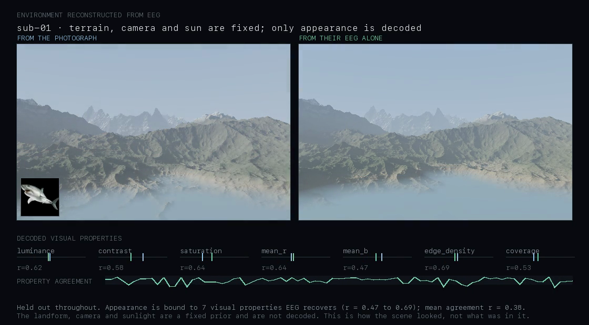

# An environment reconstructed from EEG

Video: `tools/render_environment_video.py`. Two landscapes side by side —
one graded from the photograph that was on screen, one from EEG alone.



```bash
cd backend
.venv/bin/python -m tools.render_environment_video --seconds 60
```

---

## The measurement this rests on

Object identification on this dataset is 7.6% exact. That is far too weak to
build a world from. But identification is the wrong thing to ask of EEG.

Regressing EEG onto the **visual statistics** of what was on screen — held
out, averaged over repetitions, correlated across the 200 stimuli — gives:

| Property | r | shuffled |
| --- | --- | --- |
| edge density | **0.69** | 0.07 |
| mean red | 0.64 | −0.02 |
| saturation | 0.64 | 0.05 |
| luminance | 0.62 | −0.01 |
| contrast | 0.58 | 0.01 |
| coverage | 0.53 | 0.05 |
| mean blue | 0.47 | 0.04 |

Shuffled controls stay under |r| = 0.13 throughout.

**Scalp EEG carries how a scene looked far better than what was in it.** A
landscape is exactly the kind of output that low-level visual statistics can
honestly drive, which is why this works where object reconstruction does not.

## What is decoded and what is not

| Decoded from EEG | Fixed prior |
| --- | --- |
| brightness | the landform |
| haze in the distance | the camera |
| colour saturation | sun position, and every shadow |
| warmth of the light | the material palette |
| coolness of the sky | |
| how bare the ground is | |
| how high the water stands | |

The terrain is generated before any brain activity is read and never changes.
Only appearance moves. A property must clear r = 0.35 held-out before it is
allowed to drive anything; everything else is pinned at its prior value, and
the render states which is which.

**Mean per-moment agreement between the two panels: r = 0.38.**

## How to read it honestly

The person was looking at photographs of isolated objects, not at a valley.
The left panel is not what they saw — it is what their photograph's statistics
imply about a scene, and the right panel is the same thing derived from their
brain activity. Where the two agree, the decode worked.

This is a reconstruction of **appearance**, not of place. Nothing here
recovers geometry, and no amount of modelling would: the landform is one
generated heightfield out of infinitely many, and EEG says nothing about which.

## Why the renderer is split in two

Marching rays into a heightfield costs about a minute a frame. Re-shading a
prepared view costs 0.02 s — 3,500 frames a minute. Separating geometry from
shading is what makes a video possible at all, and it enforces the honest
constraint at the same time: geometry is computed once, before any decoding,
so it *cannot* vary with the signal even by accident.
