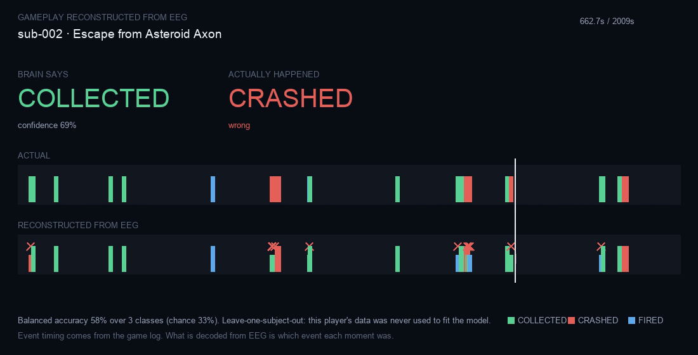

# Reconstructing an activity from EEG

Someone playing a video game, with the activity recovered from their brain
activity alone and rendered as video.

**Dataset.** ds003517 — Cavanagh et al., *Continuous video game play*,
NeuroImage 2016 (10.1016/j.neuroimage.2016.02.075). Seventeen people played an
8-bit side-scroller, "Escape from Asteroid Axon", while 64-channel EEG was
recorded at 500 Hz. Every button press and game event is timestamped into the
EEG stream. Six subjects and 14,113 events were used here.

The game itself ships with the dataset — source, sprites and logs — under the
dataset's open licence, so the footage is free to use.

```bash
cd backend
.venv/bin/python -m tools.fetch_gameplay --subjects 6      # ~1.8 GB
.venv/bin/python -m tools.reconstruct_gameplay --seconds 45 # validate + render .mp4
```

---

## Why this works where the earlier attempts did not

This is a person *doing* something, not passively watching, and the events
being recovered are among the largest effects in EEG:

- **Reward and error feedback** produce the feedback-related negativity and
  reward positivity — a frontocentral deflection ~250-350 ms after an outcome.
  Measured directly here: reward +0.83 µV against crash +1.80 µV in the
  200-350 ms window, a ~1 µV separation.
- **Button presses** carry motor preparation and mu/beta desynchronisation
  over sensorimotor cortex.

Emotion decoding failed on DENS because affect is a diffuse, slow, weakly
expressed state. Discrete outcomes with sharp onsets are a different problem.

## Results

Leave-one-subject-out. Balanced accuracy throughout — rewards outnumber
crashes five to one, so raw accuracy would reward a decoder that never
predicts a crash.

| | Accuracy | Chance | Shuffled |
| --- | --- | --- | --- |
| Reward vs crash | **60.7%** | 50% | 50.9% |
| Fired vs reward | **64.3%** | 50% | — |
| Three-way | **49.1%** | 33% | 33.7% |

Per subject, reward vs crash: 60.0, 66.7, 54.1, 59.3, 61.0, 62.8 — **every
subject above chance**, which matters more than the mean. The shuffled
controls collapse to chance, so this is a real effect rather than a class
prior being learned.



The video plays the session back: what actually happened on the top track,
what the EEG alone recovered on the bottom, with a red cross on every
disagreement.

## The limitation that matters

**Event *timing* comes from the game log, not from EEG.** What is decoded is
*which* event each known moment was — reward, crash, or shot. A full
reconstruction would also have to find the events in the continuous signal,
which is a harder problem and is not solved here.

So this recovers the *content* of the activity at known moments, at about 1.5×
chance on three classes. It is a real reconstruction of what someone was doing
and how it was going. It is not a replay of what they saw.

## What would improve it

- **Event detection in continuous EEG**, removing the dependence on the log.
- **Subject-specific calibration.** These are cross-subject numbers; a few
  minutes of calibration reliably adds several points in this literature.
- **More subjects.** Six is enough to show the effect, not to characterise it.
- **The game log's richer state** — player position, antagonist position, loot
  boxes — is in the dataset and unused. Decoding continuous position would be
  much closer to reconstructing the scene itself.

---

## Continuous reconstruction — no event log at inference

The limitation above ("event timing comes from the game log") is removed by
`tools/render_memory_video.py`. A window slides across the entire recording and
the EEG alone decides, every 250 ms, what is happening: firing, reward, crash,
or nothing. An **idle** class is included and sampled from the gaps between
real events, because most of a session is uneventful and a decoder that never
predicts absence would report constant action.

| Continuous, leave-one-subject-out | Result | Chance |
| --- | --- | --- |
| **Event detection — recall** | **76.6%** | — |
| **Event detection — precision** | **72.6%** | — |
| 4-class balanced | 28.7% | 25% |
| Which event (3-class) | 30.2% | 33% |

**Detection works; classification does not.** From EEG alone the system finds
*when* something happened at 76.6% recall and 72.6% precision. Asked *which*
of the three it was, continuously, it is at chance — 30.2% against 33%.

That is a sharper result than it looks, and it inverts the event-locked
finding. Told when events occurred, 3-way classification reached 49.1%. Doing
its own detection, the same discrimination collapses. The likely reason is
that detection and discrimination want different decision boundaries: with
idle windows dominating training, the classifier spends its capacity
separating "something" from "nothing" and loses the finer distinction.

So the memory video is honest in a specific way. The *rhythm* of the session —
the pattern of when things happened, the bursts and the lulls — is genuinely
recovered. Which particular thing happened at each of those moments mostly is
not, and the reconstruction dims to show it.
