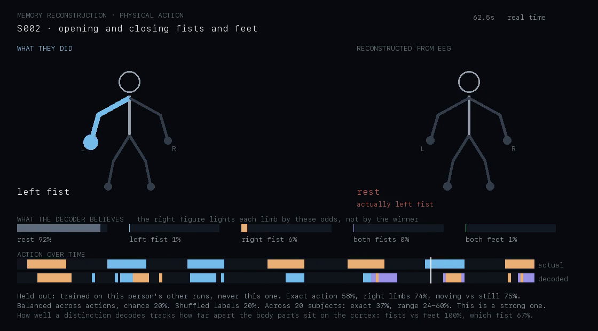

# Reconstructing what the body was doing

The earlier reconstructions ask what someone was *looking at*. This one asks
what they were *doing* — and it is the question scalp EEG is best equipped to
answer.

**Dataset.** PhysioNet EEG Motor Movement/Imagery Database (eegmmidb), Schalk
et al. 2004. 64-channel BCI2000 at 160 Hz. Twenty subjects here, recorded
while they physically opened and closed their fists and feet on cue.

Only the **executed movement** runs are used. The database also contains
matched motor *imagery* runs, which are the ones most BCI papers use; the
question here is what the body actually did, so imagined movement is the wrong
condition and was never downloaded.

Reproduce:

```bash
cd backend
.venv/bin/python -m tools.fetch_motor --subjects 20        # ~300 MB
.venv/bin/python -m tools.decode_motor --subjects 20       # the tables below
.venv/bin/python -m tools.render_motor_video --subject S002
```



---

## Why this works better than reading vision

Moving a limb suppresses the mu (8-13 Hz) and beta (13-30 Hz) rhythms over the
**opposite** sensorimotor strip — event-related desynchronization. Feet, whose
cortical representation sits on the midline between the hemispheres, suppress
it over the vertex instead.

That is a large effect with a clear spatial signature at exactly the scale
scalp electrodes can resolve. It does not require recovering fine detail, which
is what made the object work hard.

---

## Results

Twenty subjects, leave-one-run-out: the model is trained on a person's other
runs and never on the one it decodes. Every figure is **balanced** across
actions — rest is 54% of every recording, so a decoder answering "rest" and
nothing else would score 54% raw.

| Per window | Real | Shuffled | Chance | Range |
| --- | --- | --- | --- | --- |
| Exact action, five ways | **36.7%** | 19.6% | 20% | 24-60% |
| Right limbs, action may be wrong | **58.4%** | 21.3% | — | 42-83% |
| Right about moving at all | **72.2%** | 23.0% | — | 57-90% |

Broken into the questions that are actually separable:

| Sub-question | Real | Chance | Range |
| --- | --- | --- | --- |
| Moving vs rest | **76.3%** | 50% | 65-91% |
| Fists vs feet | **75.5%** | 50% | 58-100% |
| Left vs right fist | **62.0%** | 50% | 48-82% |
| Which of four limbs | **37.1%** | 25% | 22-71% |

**The gradient is the finding.** How well a distinction decodes tracks how far
apart the body parts sit on the cortex. Hands versus feet — opposite ends of
the motor homunculus — is easy. Left hand versus right hand, a few centimetres
apart across the midline, is barely better than a coin. Which of four limbs,
which requires both distinctions at once, is close to chance.

### Grading the errors

Scoring only exact matches hides that structure, the same way it did for the
object reconstruction. So errors are graded: answering *both fists* when the
truth was *right fist* means the decoder saw hand movement and could not
lateralise it, which is a different quality of error from answering *both
feet*. That is the gap between the 36.7% exact and the 58.4% right-limbs row.

---

## Read the spread, not the mean

The range column is not noise. Some people's sensorimotor rhythms are simply
much more readable than others': the best subject reaches 60% exact while the
weakest sits at 24%, barely above the 20% chance line. This split is well documented and it is why
a single-subject number from this dataset means very little on its own.

**The shipped video is S002, one of the stronger subjects**, and every frame
of it says so along with the group mean and range.

---

## What was tried

Five ideas, measured the same way each time — leave-one-run-out, balanced
accuracy, the same subjects. Two worked.

| Change | Effect on exact action |
| --- | --- |
| **Normalise each recording against itself** | **+6.4** |
| **2-second windows instead of 1-second** | **+2.7** |
| Common spatial patterns | -2.5 |
| Riemannian tangent-space features | +0.1 |
| Viterbi decoding with a transition prior | -0.8 |

Together the two that worked took exact action from 32.2% to **41.3%** on a
fixed set of eight subjects. The tables above are the twenty-subject figures
under the improved pipeline.

### Normalising each recording against itself

The largest single change, and an unglamorous one. Band power drifts between
recordings with electrode impedance and with time, and that drift is larger
than the difference between two actions. Training on one run and decoding
another forces the model across that gap unless the features are first
expressed relative to their own session.

**No labels are involved** — only the distribution of the features — which is
why applying it to a held-out run is not leakage, and why a headset can do
exactly this with its own recording.

Two variants, and the difference matters for anything real-time:

| | Effect |
| --- | --- |
| Whole session's statistics (offline reconstruction) | +6.4 |
| Only windows up to the current moment (live) | +2.6 |

The offline number is the one quoted above, because a memory is reconstructed
after it happens. A live system gets the smaller figure.

### What did not work

**Common spatial patterns**, the standard front end for this kind of decoding,
fitted per fold on training data only: +0.6 on moving-versus-rest, +1.5 on
left-versus-right fist, **-3.9** on fists-versus-feet, and 2.5 worse five-way.
The module was deleted.

**Riemannian tangent-space features**, the natural thing to try after CSP
failed: 30.3% against 30.2% for plain band power on the same montage. A wash,
for roughly sixty times the compute. Kept in the tree as `app/motor/riemann.py`
since it is correct and the measurement is the point.

**Viterbi decoding** with a tuned self-transition prior, on the theory that
four-second actions should not flicker: 34.1% at best against 34.9% for plain
argmax. Overlapping two-second windows already carry the temporal structure,
so an explicit transition model only adds lag.

**Restricting the decoder to the actions a run can contain.** Raw accuracy
rises from 32.2% to 41.2%, but chance rises from 20% to 33% with it, so the
effect size *falls* — 1.25x chance against 1.61x. The constraint mostly hands
the model the easy fists-versus-feet call.

---

## How many electrodes, and where

This is the question that matters before buying a headset, so it was measured
rather than guessed. Six subjects, same pipeline, channels dropped from the
montage:

| Montage | Channels | Exact action |
| --- | --- | --- |
| Full cap | 64 | 40.5% |
| Sensorimotor strip | 21 | 35.1% |
| Central | 12 | 34.0% |
| Central | 8 | 32.0% |
| Central | 4 | 28.7% |
| **Frontal only** | 8 | **24.4%** |
| **Muse layout (AF7, AF8, TP9, TP10)** | 4 | **22.3%** |

Chance is 20%.

**Position matters far more than count.** Four electrodes over motor cortex
(28.7%) beat eight frontal ones (24.4%) comfortably. A Muse, whose electrodes
sit on the forehead and behind the ears, scores 22.3% — close enough to chance
to call it nothing, because it has no sensor anywhere near the sensorimotor
strip.

Anything intended to read movement needs contacts at or around **C3, Cz and
C4**. An eight-channel headset placed there retains about four fifths of what
a 64-channel cap gets.

---

## What this is not

These are cued, isolated limb movements in a lab, not cooking or sport. That
gap is not an oversight: vigorous whole-body movement floods scalp EEG with
muscle and motion artifact, which is why public datasets pairing EEG with
free real-world activity — and with video of it — barely exist. The honest
version of "reconstruct someone playing a sport" needs either a measurement
that tolerates movement, or a dataset that does not yet exist publicly.

## What would raise the ceiling

- **More electrodes over sensorimotor cortex, or a Laplacian montage.** The
  left/right distinction is spatially fine and 64 channels spread over the
  whole scalp under-samples exactly where it matters.
- **Per-subject band tuning.** Peak mu frequency varies by several Hz between
  people; fixed 8-13 Hz costs the subjects whose peak sits outside it.
- **Riemannian tangent-space features.** The natural next thing to try after
  CSP failed, and it works on covariances that are already being computed.
