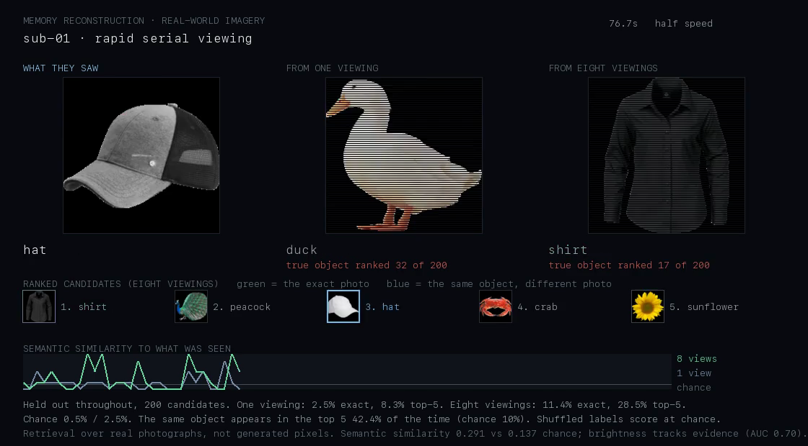

# Reconstructing real life


> **Retired from the product.** The image-matching UI was removed: a ranked
> strip of candidate photographs is a thin thing to look at, and the honest
> result below is better read as a table than operated as a feature. The
> analysis and its controls are kept here because the numbers are real.
The gameplay reconstruction answers *what was happening*. This one answers
*what was he looking at*, over a continuous stream of real-world photographs,
moment by moment, in the order they were actually seen.

**Dataset.** ds004018 — Grootswagers, Robinson & Carlson (2019), *The
representational dynamics of visual objects in rapid serial visual processing
streams*, NeuroImage 188:668-679. Three subjects here, 63-channel EEG at
1000 Hz, 200 object photographs in 5 Hz streams, 40 repetitions each, 8,000
presentations per subject.

Reproduce:

```bash
cd backend
.venv/bin/python -m tools.fetch_dataset --subjects 3     # ~2.4 GB
.venv/bin/python -m tools.decode_stream --subjects 3     # the table below
.venv/bin/python -m tools.render_reallife_video --seconds 75
```



---

## Why this dataset and not the naturalistic-video one

The obvious candidate for "real life" was ds003751 (DENS): forty people
watching emotionally evocative film clips with EEG recorded throughout. It is
genuinely naturalistic video, and we already have it.

**It ships no stimuli.** The clips are copyrighted film and are not
distributed with the dataset, so there are no ground-truth frames to score a
reconstruction against. That is why the DENS work produced an affective trace
rather than a picture, and why it stays that way — see [EMOTION.md](EMOTION.md),
including the negative result that cross-subject emotion decoding failed there.

ds004018 has what DENS lacks: the actual images, a randomised presentation
order, and per-presentation ground truth. Its streams run at 5 Hz, which makes
them a continuous sequence of real-world imagery — a real-life video with a
label on every frame.

---

## Results

Three subjects, 8,000 moments each, held out throughout.

| Eight viewings | Result | Chance |
| --- | --- | --- |
| Exact photograph recovered | **7.6%** | 0.5% |
| Exact photograph in top 5 | **20.1%** | 2.5% |
| **Same object in top 5** (any photo of it) | **42.4%** | ~10% |
| Top-1 has correct category | **25.0%** | 10% |
| Top-1 has correct animacy | **62.4%** | 50% |
| Graded semantic similarity | **0.254** | 0.137 |

| One viewing | Result | Chance |
| --- | --- | --- |
| Exact photograph recovered | 1.8% | 0.5% |
| Exact photograph in top 5 | 6.7% | 2.5% |
| Top-1 has correct animacy | 53.8% | 50% |
| Graded semantic similarity | 0.167 | 0.137 |

*(The 42.4% and the video's other single-subject figures are sub-01, which
runs a little above the three-subject mean.)*

### The graded metric

Exact match is the wrong single number here. Answering *cow* for a *monkey* is
a far better reconstruction than answering *scissors*, and a metric that
scores both zero throws away most of what EEG carries. So every reconstruction
is also scored on a graded scale over the dataset's own hierarchy:

| Tier | Score |
| --- | --- |
| the same photograph | 1.00 |
| a different photograph of the same object | 0.80 |
| same category — another mammal, another tool | 0.50 |
| only animate/inanimate agrees | 0.20 |
| unrelated | 0.00 |

Those weights are a choice. The **chance level they imply is not**: it is
computed by averaging the metric over all 200×200 (truth, guess) pairs in the
actual catalogue, which gives 0.137. Every similarity figure above is stated
against that measured baseline rather than an assumed one.

---

## Controls

| | cross-validated | strict time split | shuffled labels | chance |
| --- | --- | --- | --- | --- |
| exact (1 viewing) | 0.018 | 0.015 | 0.005 | 0.005 |
| top-5 (1 viewing) | 0.067 | 0.062 | 0.025 | 0.025 |
| similarity (1 viewing) | 0.167 | 0.163 | 0.135 | 0.137 |
| exact (8 viewings) | 0.076 | 0.120 | 0.005 | 0.005 |
| similarity (8 viewings) | 0.254 | 0.294 | 0.137 | 0.137 |

**Shuffled labels land on chance everywhere.** Identical pipeline, permuted
identities: 0.005 exact against 0.005 chance, 0.137 similarity against 0.137.

**The strict time split does not collapse the result.** Presentations are
200 ms apart while epochs are 700 ms long, so neighbouring trials share raw
samples and a random split can leak. Fitting on the first 60% of the session
and reconstructing the last, with a gap, holds up.

One thing to read carefully: the time split's *eight-viewing* column is
**higher**, not lower. That is not the control outperforming the thing it
controls. The time split leaves a larger held-out tail, so its consolidated
track averages 15.7 viewings rather than 7.9, and more viewings is simply
better. The like-for-like comparison is the one-viewing table, which moves
from 0.018 to 0.015 — a slight drop, no collapse.

---

## How to read this honestly

**One viewing is not a reconstruction.** At 1.8% exact, the top answer is
wrong 98% of the time. It is three to four times chance, which is a real
effect, but nothing about a single 200 ms glimpse is recoverable as a picture.

**Eight viewings is a coarse semantic sketch.** The exact photograph is
recovered 7.6% of the time — fifteen times chance, and still wrong in
nine cases out of ten. What holds up much better is *the kind of thing*: the
same object appears somewhere in the top five 42.4% of the time, and the
top candidate shares the category in a quarter of moments.

That gap is the finding, and the video is built to show it. When the person
looked at a hat, the strip frequently contains a hat — a different hat,
photographed differently, outlined blue rather than green. **EEG carries what
was seen far better than which one.**

**The averaging is a real condition, not a trick, but it is a condition.**
Each object was seen 40 times across the session; the consolidated track
averages the ~8 held-out viewings within its fold. That is a reconstruction of
a *revisited* memory, not a live read. A headset worn for one evening would be
in the one-viewing column.

**Confidence is weak but real.** How far the winning candidate stands above
the field predicts whether it is right at AUC 0.70 for the consolidated track
— usable, and what the panel brightness in the video tracks. For a single
viewing it is AUC 0.58, which is close enough to useless that it should not be
shown as certainty.

### What this is not

It is not a reconstruction of naturalistic video. These are isolated objects
on plain backgrounds, presented in a randomised stream — real-world imagery,
not a real-world *scene*. Nothing here supports a claim about reconstructing
someone's afternoon.

---

## What would raise the ceiling

Unchanged from [REAL_DATA.md](REAL_DATA.md), and in the same order:

- **A different measurement.** fMRI or MEG. This dominates everything else.
- **More repetitions.** Identification is still climbing at 8 viewings.
- **A dataset with naturalistic video *and* distributed stimuli.** This is the
  specific blocker on reconstructing real scenes rather than real objects.
  DENS has the video and withholds it; ds004018 has the ground truth and no
  scenes.
