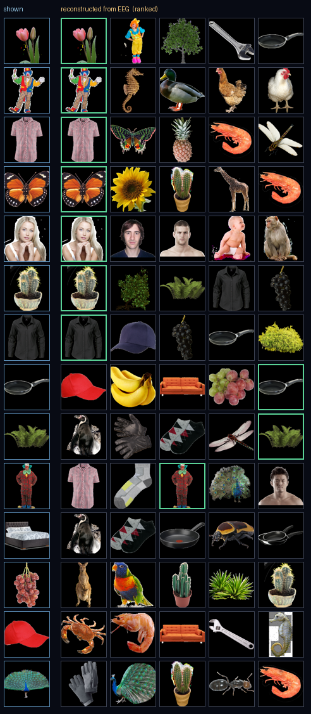

# Reconstruction from real human EEG

Everything here comes from recordings of actual people, not simulation.

**Dataset.** ds004018 — Grootswagers, Robinson & Carlson (2019), *The
representational dynamics of visual objects in rapid serial visual processing
streams*, NeuroImage 188:668-679. Sixteen subjects, 63-channel EEG at 1000 Hz,
200 object photographs presented in 5 Hz RSVP streams, ~40 repetitions each.

Reproduce:

```bash
cd backend
.venv/bin/python -m tools.fetch_dataset --subjects 4   # ~2.4 GB
.venv/bin/python -m tools.decode_real                  # accuracy + controls
.venv/bin/python -m tools.reconstruct_real --trials 8  # contact sheet
```

---

## Why this dataset

The widely-cited EEG-to-image results (Spampinato et al. 2017, and the
DreamDiffusion line built on that data) used a **block design**: every image of
a class shown consecutively. Li et al. 2020, *The Perils and Pitfalls of Block
Design for EEG Classification Experiments*, showed those models were largely
decoding **block position in time** rather than visual content, and that the
accuracy collapses under a randomised design.

ds004018 randomises stimulus order within each RSVP stream. Decoding here
cannot be explained by temporal structure, which is what makes the numbers
below worth reporting.

---

## Results

Four subjects, held-out trials throughout.

### Semantic decoding

| | Accuracy | Chance |
| --- | --- | --- |
| Animate vs inanimate | **67.4%** | 50% |
| — strict time split | 66.2% | 50% |
| — shuffled-label control | 50.5% | 50% |
| Category (10-way) | **32.4%** | 10% |
| — strict time split | 30.3% | 10% |

### 200-way identification

Matching EEG against per-stimulus templates, ranking all 200 candidates.

| Viewings averaged | Top-1 | Top-5 | Pairwise |
| --- | --- | --- | --- |
| 1 | 1.8% | 6.3% | 60.9% |
| 4 | 3.1% | 10.9% | 69.7% |
| 10 | **5.6%** | **15.9%** | **74.9%** |
| shuffled control | 0.88% | — | ~50% |
| *chance* | *0.5%* | *2.5%* | *50%* |

### Reconstruction by retrieval (8 viewings averaged)

| | Result | Chance |
| --- | --- | --- |
| Exact object recovered (200-way) | **6.1%** | 0.5% |
| Correct object in top 5 | **17.8%** | 2.5% |
| Top-1 has correct animacy | **61.5%** | 50% |
| Top-1 has correct category | **24.4%** | 10% |



Left column is what the person looked at; the row to its right is what the
system recovered from their brain activity, ranked. A green outline marks the
correct object.

---

## Controls

Three checks, all of which a leaking pipeline would fail:

1. **Shuffled labels.** Identical pipeline, permuted labels. Identification
   drops to 0.88% (chance 0.5%) and animacy to 50.5% (chance 50%).
2. **Pre-stimulus decoding.** Accuracy computed at every timepoint sits at
   **49.9%** before the image appears and peaks at **+284 ms**. Elevated
   pre-stimulus accuracy is the signature of leakage; there is none.
3. **Strict time split.** Stimuli appear every 200 ms while epochs are 700 ms
   long, so neighbouring trials overlap and a random split can leak. Training
   on the first 60% of the session and testing on the last, with a gap,
   *matches or exceeds* the cross-validated numbers — so the result does not
   depend on temporal adjacency.

---

## How to read this honestly

**6.1% exact means the top candidate is wrong 94% of the time.** It is twelve
times chance, which is a real effect and not a small one, but it is nowhere
near replay.

The structure of the errors is the interesting part. When the exact object is
not first, the candidates beating it are usually from the same category —
plants for plants, mammals for mammals. In the example shipped in the UI, a
*monkey* was shown, the correct answer ranked 20th, and the top candidate was
a *cow*: wrong object, right animacy, right category. **EEG carries what kind
of thing was seen far more reliably than which particular one.**

That is the honest shape of the capability: a coarse semantic sketch of a
visual experience, not a recording of it.

### Why retrieval rather than generation

Retrieval returns a real photograph, so when the ranking is right the output
is exactly what the person saw, and the rank of the true stimulus states
precisely how much the brain signal narrowed the field.

Generating pixels instead — conditioning a diffusion model on a decoded
embedding — produces images that *look* like reconstructions while being
mostly the generative prior's invention, because scalp EEG does not carry
per-pixel information. The published systems that produce genuinely
recognizable generated images use **fMRI** (MindEye2, Takagi & Nishimoto) or
**MEG** (Benchetrit et al.), which have spatial bandwidth scalp EEG lacks.

Retrieval's real limitation, stated plainly: **it can only return objects
already in its candidate set.** It recognises; it does not imagine.

---

## What would raise the ceiling

In rough order of effect:

- **A different measurement.** fMRI or MEG, not EEG. This is the dominant term
  by a wide margin.
- **More repetitions per item.** Identification roughly triples from 1 to 10
  averaged viewings; the curve has not flattened.
- **Subject-specific models with more training data.** These decoders are
  fitted per subject on ~6,400 trials.
- **Nonlinear decoders.** Worth trying once the data supports them; a linear
  model was chosen here so results remain attributable.
